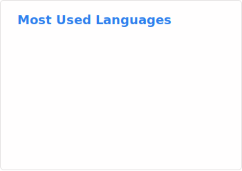
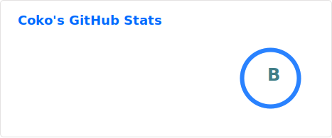

Hey, I'm Coko 

A french developer who's passionate about programming and open-source.

I love working in Linux and the terminal is where I spend most of my time.

    
    

    Stat cards generated with 
    <a href="https://github.com/anuraghazra/github-readme-stats">github-readme-stats</a>

#### 👷 My active projects

- [terminalcollective/website](https://github.com/terminalcollective/website) -  (2 days ago)
- [coko7/Coko7](https://github.com/coko7/Coko7) - ✨ Personal README (4 days ago)
- [coko7/.dotfiles](https://github.com/coko7/.dotfiles) - 🔧 All the .dotfiles that I use for my Linux config (6 days ago)

#### 🌱 My latest projects

- [coko7/bookshelf](https://github.com/coko7/bookshelf) - 📚 List of books I read / am reading / want to read.
- [coko7/huco705-archive](https://github.com/coko7/huco705-archive) - 📦 Archive repo for my my first computer program ever
- [coko7/learn-go-web-examples](https://github.com/coko7/learn-go-web-examples) - 📖 Learning Go language web via https://gowebexamples.com

#### ⭐ Recent Stars

- [msokalski/asciicker](https://github.com/msokalski/asciicker) - 3D ASCII game concept (1 day ago)
- [dlvhdr/dotfiles](https://github.com/dlvhdr/dotfiles) - 🏠 (1 day ago)
- [tmux-plugins/tmux-urlview](https://github.com/tmux-plugins/tmux-urlview) - Quickly open any url on your terminal window! (1 day ago)

<picture>
  <source media="(prefers-color-scheme: dark)"  srcset="https://raw.githubusercontent.com/Coko7/Coko7/snake/github-contribution-grid-snake-dark.svg">
  <source media="(prefers-color-scheme: light)" srcset="https://raw.githubusercontent.com/Coko7/Coko7/snake/github-contribution-grid-snake-light.svg">
  
</picture>
