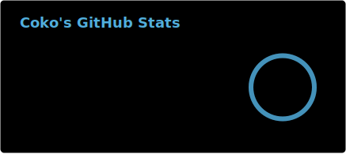
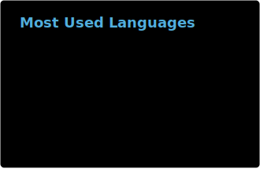

Hey, I'm Coko 

A french developer who's passionate about programming and open-source.

I love working in Linux and the terminal is where I spend most of my time.

    <picture>
        <source media="(prefers-color-scheme: dark)" srcset="./images/grs-user-stats-dark.svg">
        <source media="(prefers-color-scheme: light)" srcset="./images/grs-user-stats-light.svg">
        
    </picture>
    <picture>
        <source media="(prefers-color-scheme: dark)" srcset="./images/grs-top-langs-dark.svg">
        <source media="(prefers-color-scheme: light)" srcset="./images/grs-top-langs-light.svg">
        
    </picture>

#### 👷 My active projects

- [coko7/f-win](https://github.com/coko7/f-win) - 🤬 A handy script to &#34;fix&#34; Windows by installing decent CLIs and apps. (2 days ago)
- [coko7/Coko7](https://github.com/coko7/Coko7) - ✨ Personal README (4 days ago)
- [terminalcollective/website](https://github.com/terminalcollective/website) -  (1 week ago)

#### 🌱 My latest projects

- [coko7/f-win](https://github.com/coko7/f-win) - 🤬 A handy script to &#34;fix&#34; Windows by installing decent CLIs and apps.
- [coko7/bookshelf](https://github.com/coko7/bookshelf) - 📚 List of books I read / am reading / want to read.
- [coko7/huco705-archive](https://github.com/coko7/huco705-archive) - 📦 Archive repo for my my first computer program ever

#### ⭐ Recent Stars

- [nikolassv/bartib](https://github.com/nikolassv/bartib) - A simple timetracker for the command line. It saves a log of all tracked activities as a plaintext file and allows you to create flexible reports. (1 day ago)
- [ShareX/ShareX](https://github.com/ShareX/ShareX) - ShareX is a free and open-source application that enables users to capture or record any area of their screen with a single keystroke. It also supports uploading images, text, and various file types to a wide range of destinations. (1 day ago)
- [gold-silver-copper/ahoj](https://github.com/gold-silver-copper/ahoj) -  (1 day ago)

<picture>
  <source media="(prefers-color-scheme: dark)"  srcset="https://raw.githubusercontent.com/Coko7/Coko7/snake/github-contribution-grid-snake-dark.svg">
  <source media="(prefers-color-scheme: light)" srcset="https://raw.githubusercontent.com/Coko7/Coko7/snake/github-contribution-grid-snake-light.svg">
  
</picture>
