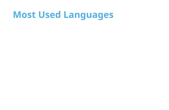

Hey, I'm Coko 

A french developer who's passionate about programming and open-source.

I love working in Linux and the terminal is where I spend most of my time.

    <picture>
        <source media="(prefers-color-scheme: dark)" srcset="./images/grs-user-stats-dark.svg">
        <source media="(prefers-color-scheme: light)" srcset="./images/grs-user-stats-light.svg">
        
    </picture>
    <picture>
        <source media="(prefers-color-scheme: dark)" srcset="./images/grs-top-langs-dark.svg">
        <source media="(prefers-color-scheme: light)" srcset="./images/grs-top-langs-light.svg">
        
    </picture>

#### 👷 My active projects

- [coko7/watari](https://github.com/coko7/watari) - ☕ Web GUI frontend for rustypaste with OpenID Connect SSO and optional client-side encryption. (1 day ago)
- [coko7/scripts](https://github.com/coko7/scripts) - 🛠️ My personal collection of shell scripts I rely on everyday. (1 day ago)
- [coko7/f-win](https://github.com/coko7/f-win) - 🤬 A handy script to &#34;fix&#34; Windows by installing decent CLIs and apps (5 days ago)

#### 🌱 My latest projects

- [coko7/tuiss](https://github.com/coko7/tuiss) - 🌐 TUI for managing IIS sites via appcmd, built in Rust with ratatui
- [coko7/tty-blog](https://github.com/coko7/tty-blog) - ✍️ Source code for my zola blog (The Terminal Yard) 
- [coko7/zmk-config](https://github.com/coko7/zmk-config) - ⌨️ ZMK config for my 5-col crkbd with nice!view display keyboard.

#### ⭐ Recent Stars

- [EvanZhouDev/cubecode](https://github.com/EvanZhouDev/cubecode) - Store data on Rubik&#39;s cubes (2 days ago)
- [geohot/fromthetransistor](https://github.com/geohot/fromthetransistor) - From the Transistor to the Web Browser, a rough outline for a 12 week course (2 days ago)
- [mainmatter/100-exercises-to-learn-rust](https://github.com/mainmatter/100-exercises-to-learn-rust) - A self-paced course to learn Rust, one exercise at a time. (4 days ago)

<picture>
  <source media="(prefers-color-scheme: dark)"  srcset="https://raw.githubusercontent.com/Coko7/Coko7/snake/github-contribution-grid-snake-dark.svg">
  <source media="(prefers-color-scheme: light)" srcset="https://raw.githubusercontent.com/Coko7/Coko7/snake/github-contribution-grid-snake-light.svg">
  
</picture>
